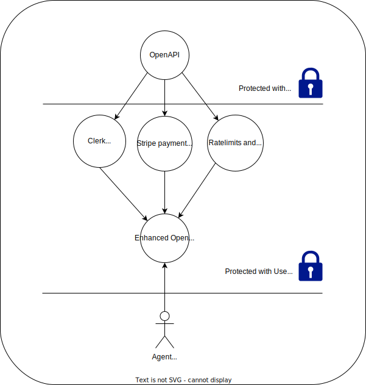

# User OpenAPI

Stateless functionality that is useful to be hosted in a serverless environment can quickly be deployed in a scalable way. However, in order to give it to third parties, we need to find a way to manage these users, and monetize it.

As a result, SaaS startups always need to build the same stuff: sign up, log-in, creating api keys, choosing a plan, showing usage statistics, deducting credit, etc.

But what if this could simply be a wrapper around any secret openapi? Would this be useful and save complexity?

The thing is that - if it's truly stateless - this is definitely useful. But what if it's not entirely stateless? In that case, wouldn't it only be annoying to have the user-management in a separate place, impossible to be extended? That is probably true - it creates a bigger complexity overall. But maybe the DX on that can be improved as well.

This project intends to be a simple wrapper around simple stateless functionality. It takes in an OpenAPI and poops out a new OpenAPI that is very similar but adds monetisation and user-based authorization, usage, ratelimits, and whatnot.

Having this abstraction as a modular wrapper can be very beneficial because it abstracts away a lot of complexity from the real functionality of any function. This would reduce complexity for building any software system and would bring us closer to agents that can build software.

This project is part of the bigger [ActionSchema toolkit](https://github.com/CodeFromAnywhere).

Let's raise the bar for agents.

# TODO

Clerk is by far the best known one that has o-auth and nextjs integration out of the box. This should be easy.

This nextjs project should allow anyone to setup their user-openapi proxy:

- Make `create,read,update,delete`: CRUD endpoints to create new user-openapi proxy by passing `{ slug, openapiUrl, openapiAuthToken, adminToken, clerkSecretKey, clerkProjectId }` (do this in data.actionschema.com)
- Serve original api at `[slug]/openapi.json` and proxy the traffic without wall first.
- Enhance that openapi by adding the oauth2 standard with links to login/signup etc which are served at `login.actionschema.com/[slug]/login` which basically serve nice clerk components for that.
- api requests should respond with unauthorized 401 or pass the authorized userId to the original API
- should be compatible with OpenAI GPTs (now, I have an audience!)
- can I auto-signup when receiving a message in whatsapp? creating or finding a clerk-user automatically based on the phonenumber? how would that work? I need clerk-based user-management. I need a thread-messages CRUD with a split on the userid. Then I should be good!

# Later

- ratelimits
- pricing
